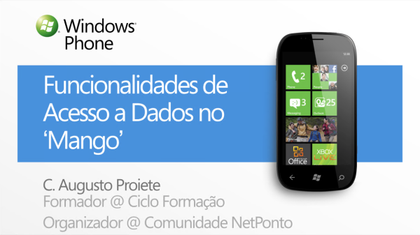

#  Funcionalidades de Acesso a Dados no Windows Phone 7 'Mango'

Código-fonte das demonstrações que fiz durante a minha apresentação sobre [as novas funcionalidades de acesso a dados no Windows Phone 7 'Mango'](http://www.slideshare.net/augustoproiete/funcionalidades-de-acesso-a-dados-no-mango) no evento [Windows Phone 7 'Mango' Dev Hub](http://blogs.msdn.com/b/msdnportugal/archive/2011/06/15/evento-wp7-mango-dev-hub-29-de-junho-audit-243-rio-microsoft-portugal.aspx).

## Notas ##

* Requer o [Windows Phone Developer Tools 7.1 Beta](http://www.microsoft.com/download/en/details.aspx?id=11321).
